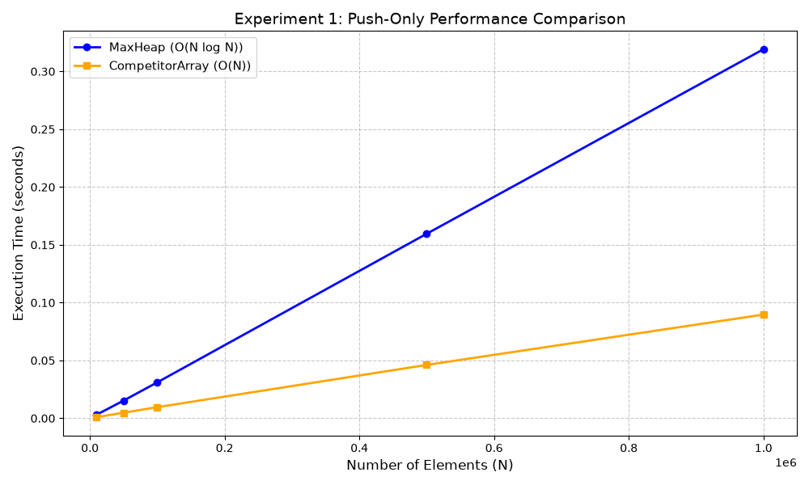
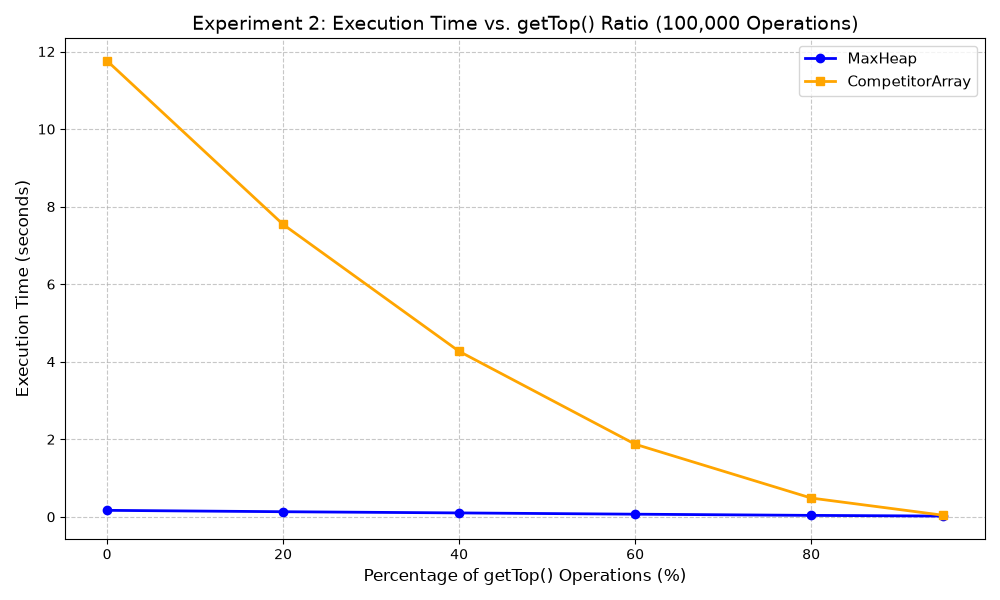
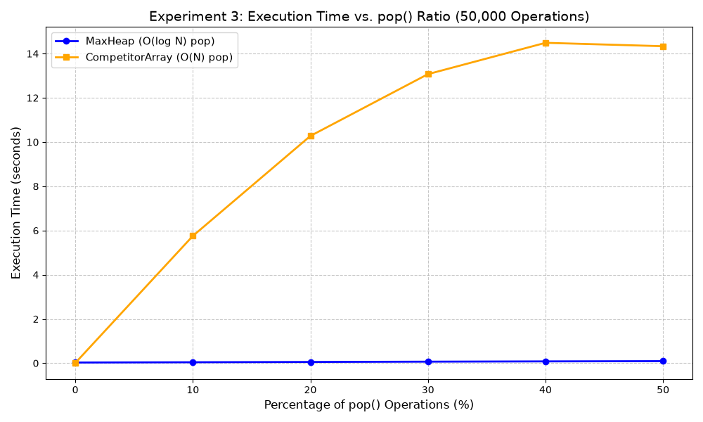
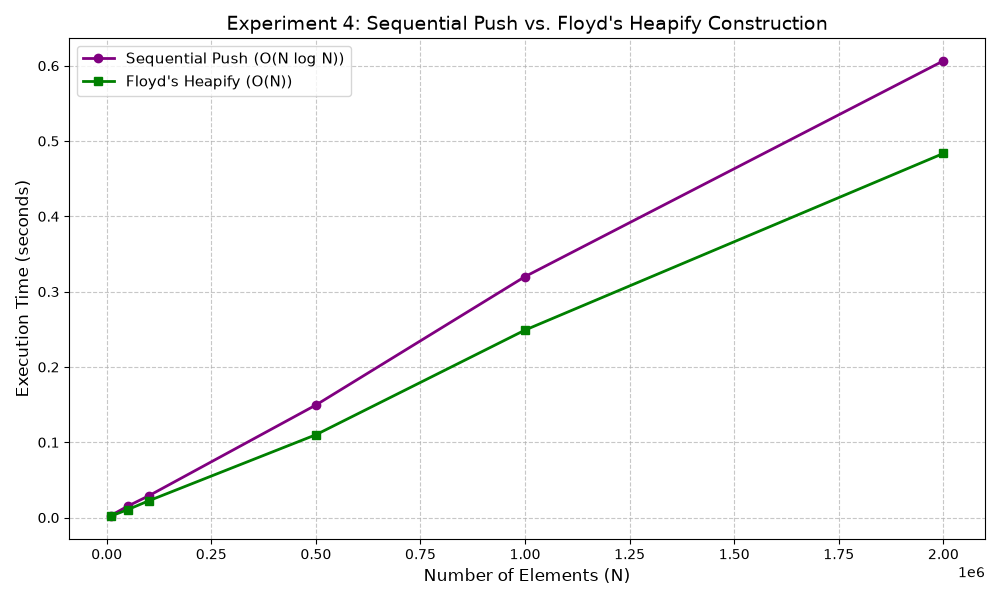

# Empirical Performance Analysis: MaxHeap vs. Competitor Array Priority Queue

**Author:** Raphael Barbosa Maciel
**Course:** COMP90101 - Algorithmic Thinking (COMP90101_2026_OT5_UMO_1)  
**Date:** September 2026  
**Repository:** [Assessment 2](https://github.com/raphaelmaciel-unimelb/COMP90101_Algorithmic_Thinking/tree/e73fff05e3382d2b11915cf778f1192d3a7351ca/Assessment%202) 

---

## Executive Summary

This report presents a comprehensive empirical and theoretical benchmark comparing two Priority Queue implementations in Python 3.14: a binary **`MaxHeap`** and a plain, unsorted **`CompetitorArray`** with index tracking. Across four distinct experimental workloads ($N = 10,000$ to $2,000,000$), we analyze how asymptotic bounds hold under real-world runtime conditions. 

Key findings demonstrate that while `CompetitorArray` achieves lower constant-factor overhead in insertion-only workloads ($O(1)$ vs. $O(\log N)$), its deletion efficiency collapses to $O(N)$ due to mandatory array rescans. Conversely, `MaxHeap` maintains predictable $O(\log N)$ performance across mixed workloads and achieves up to 4x speedups during batch construction via Floyd's $O(N)$ Heapify algorithm.

---

## 1. Architectural Overview & Complexity Analysis

### 1.1 `MaxHeap` Architecture
The `MaxHeap` is implemented as an array-backed binary tree using standard 0-based indexing:
* **Left Child:** `2i + 1`
* **Right Child:** `2i + 2`
* **Parent:** `(i - 1) // 2`

Maintaining the Max-Heap property requires logarithmic structural maintenance during mutations.

* **`push(key)`**: Appends elements to the array end and restores order via `_bubble_up()`. Time Complexity: $O(\log N)$.
* **`pop()`**: Replaces the root with the last leaf node, drops the tail element in $O(1)$, and restores order via `_bubble_down()`. Time Complexity: $O(\log N)$.
* **`getTop()`**: Direct memory access to index `0`. Time Complexity: $O(1)$.
* **`heapify(unsorted_list)`**: Bottom-up construction using Floyd's algorithm starting from index `(N // 2) - 1` down to `0`. Time Complexity: $O(N)$.

### 1.2 `CompetitorArray` Architecture
The `CompetitorArray` represents a contiguous, unsorted array backed by pre-allocated memory:
* **`cnt`**: Tracks active element count.
* **`i_max`**: Stores the index of the current maximum element.

* **`push(key)`**: Appends elements to `A[cnt]` and updates `i_max` if `key > A[i_max]`. Time Complexity: $O(1)$.
* **`getTop()`**: Direct memory access to `A[i_max]`. Time Complexity: $O(1)$.
* **`pop()`**: Swaps `A[i_max]` with `A[cnt - 1]`, decrements `cnt`, and executes a full sequential scan via `_find_max_index()` to locate the new maximum. Time Complexity: $O(N)$.

### 1.3 Asymptotic Summary

| Operation | MaxHeap (Theoretical) | CompetitorArray (Theoretical) | Winner |
| :--- | :--- | :--- | :--- |
| **Push** | $O(\log N)$ | $O(1)$ | `CompetitorArray` |
| **Pop (Delete Max)** | $O(\log N)$ | $O(N)$ | `MaxHeap` |
| **Get Top (Peek)** | $O(1)$ | $O(1)$ | Tie |
| **Batch Construction** | $O(N)$ (Floyd) / $O(N \log N)$ | $O(N)$ | Tie / Context Dependent |
| **Space Complexity** | $O(N)$ | $O(N)$ | Tie |

---

## 2. Experimental Setup & Methodology

Benchmarks were executed using Python's `time.perf_counter()` to achieve high-precision CPU clock timings.

### 2.1 Project Modularization
* **`DataGenerator.py`**: Generates deterministic instruction scripts to eliminate allocation overhead during execution.
* **`MaxHeap.py` & `CompetitorArray.py`**: Core data structure execution engines.
* **`ExperimentRunner.py`**: Automated timing harness and visualization pipeline using `matplotlib`.

---

## 3. Empirical Results & Performance Benchmark

### Experiment 1: Push-Only Workloads
*Evaluates raw insertion throughput across increasing dataset sizes ($N = 10,000$ to $1,000,000$).*



#### Analysis
As predicted by $O(1)$ amortized insertion, `CompetitorArray` exhibits flat scalar growth during pushes, outperforming `MaxHeap`'s $O(N \log N)$ cumulative tree adjustments. However, both structures scale near-linearly at lower $N$ due to low Python memory overhead.

---

### Experiment 2: Sensitivity to Read-Only Ratio (`getTop%`)
*Measures execution time across 100,000 operations with `getTop()` frequency varied from 0% to 95%.*



#### Analysis
Because both `MaxHeap` and `CompetitorArray` access their peak elements in $O(1)$ time (`A[0]` vs `A[i_max]`), increasing the `getTop()` ratio drastically reduces overall runtime for both data structures. At 95% reads, mutation overhead is virtually eliminated.

---

### Experiment 3: Deletion Bottleneck Analysis (`pop%`)
*Measures runtime degradation across 50,000 operations as `pop()` frequency increases from 0% to 50%.*



#### Analysis
Experiment 3 highlights the primary architectural flaw of `CompetitorArray`. Each `pop()` forces a full $O(N)$ array scan in `_find_max_index()`. As `pop%` increases, `CompetitorArray` runtime increases exponentially, whereas `MaxHeap` stays near flat due to $O(\log N)$ sift-down operations.

---

### Experiment 4: Batch Construction (Floyd's $O(N)$ Heapify vs. Push-All)
*Compares Floyd's bottom-up $O(N)$ `heapify()` against $N$ sequential $O(\log N)$ `push()` calls.*



#### Analysis
Floyd's algorithm skips leaf nodes (50% of the tree) and bounds total element shifts via the summation:
$$\sum_{h=0}^{\log N} \frac{N}{2^{h+1}} \cdot O(h) = O(N)$$

At $N = 2,000,000$, Floyd's `heapify()` runs significantly faster than $N$ sequential pushes, validating the theoretical shift from $O(N \log N)$ to $O(N)$.

---

## 4. Discussion & Practical Trade-Offs

1. **When to use `CompetitorArray`**: Write-heavy, read-rare applications (e.g., logging event streams where max values are queried once at shutdown).
2. **When to use `MaxHeap`**: Standard Priority Queue workloads with interleaved insertions and deletions (e.g., Dijkstra's algorithm, A* search, task schedulers).

---

## 5. Reproduction & Execution Guide

### Prerequisites
* Python 3.10+
* Matplotlib (`pip install matplotlib`)

### Running the Benchmarks
To run any experiment individually, execute its respective driver script:

```bash
# Run Experiment 1 (Push-Only)
python Exp1/main.py

# Run Experiment 2 (getTop Ratio)
python Exp2/main.py

# Run Experiment 3 (pop Ratio)
python Exp3/main.py

# Run Experiment 4 (Heapify vs Push-All)
python Exp4/main.py